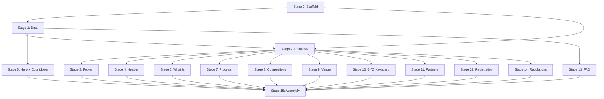

# Rewrite Plan: `preview.html` → Astro

This document tracks the incremental rewrite of the meet landing page from a single in-browser React HTML file into an Astro project. Each stage is a self-contained, reviewable unit of work. Stages should be completed in order — later stages depend on earlier ones.

---

## Stage Overview

| #   | Stage                           | Scope                                                   | Depends On |
| --- | ------------------------------- | ------------------------------------------------------- | ---------- |
| 0   | **Project Scaffold**            | Directories, CSS custom properties, `BaseLayout.astro`  | —          |
| 1   | **Data Layer**                  | `src/data/meet.ts` — all content extracted from preview | 0          |
| 2   | **Shared Primitives**           | `Button`, `SectionLabel`, `MeetLogo`                    | 1          |
| 3   | **Site Footer**                 | `SiteFooter.astro`                                      | 2          |
| 4   | **Site Header**                 | `SiteHeader.astro` (navbar with Alpine scroll effect)   | 2          |
| 5   | **Hero Banner**                 | `meet/HeroBanner.astro` + `Countdown.astro`             | 1, 2       |
| 6   | **What Is Section**             | `meet/WhatIsSection.astro`                              | 1, 2       |
| 7   | **Program Section**             | `meet/ProgramSection.astro`                             | 1, 2       |
| 8   | **Competitions Section**        | `meet/CompetitionsSection.astro`                        | 1, 2       |
| 9   | **Venue Section**               | `meet/VenueSection.astro`                               | 1, 2       |
| 10  | **Bring Your Keyboard Section** | `meet/BringYourKeyboardSection.astro`                   | 1, 2       |
| 11  | **Partners Section**            | `meet/PartnersSection.astro`                            | 1, 2       |
| 12  | **Registration Section**        | `meet/RegistrationSection.astro`                        | 1, 2       |
| 13  | **FAQ Section**                 | `FaqAccordion.astro` → used directly in page            | 1          |
| 14  | **Regulations Section**         | `meet/RegulationsSection.astro`                         | 1, 2       |
| 15  | **Page Assembly**               | `index.astro` — compose all sections, final polish      | 3, 4, 5–14 |

---

## Stage 0 — Project Scaffold

**Goal:** A working dev server serving a nearly-empty page through the correct layout, with CSS custom properties defined for the entire design system.

**Files to create/modify:**

- `src/layouts/BaseLayout.astro` — HTML shell
- `src/assets/styles/custom-properties.css` — CSS variables (colors, fonts, spacing, breakpoints)

**What this stage includes:**

- `<html>`, `<head>`, `<body>` structure
- Character encoding, viewport meta, title, description meta
- Font preconnects and `@font-face` declarations (extracted from `preview.html` `<head>`)
- Global reset (`*, *::before, *::after`, `html`, `body`)
- All CSS custom properties (colors, font sizes, spacing scale, border radii, shadows)
- Responsive breakpoints as variables
- A minimal `<style>` block in `BaseLayout` that imports or references the custom properties
- A temporary `src/pages/index.astro` that uses `BaseLayout` and renders "Hello" text

**Review checklist:**

- [ ] `astro dev` starts without errors
- [ ] Browser renders a page with the correct `<title>`
- [ ] All CSS variables are inspectable in DevTools
- [ ] Fonts load correctly
- [ ] `<html lang="pl">` is set

---

## Stage 1 — Data Layer

**Goal:** All text content, URLs, FAQ entries, and program schedule extracted from `preview.html` into a single TypeScript data file.

**Files to create:**

- `src/data/meet.ts`

**What to extract:**

- Event date, ISO date, venue name, hours, address
- Google Maps URL, registration form URL, regulations PDF URL
- Discord invite, Instagram handle, contact email
- FAQ questions and answers (as an array of `{ q, a }` objects)
- Program schedule items (as an array of `{ time, title, description }` objects)
- Competition descriptions (Switch Guessing, Best Build)
- Venue description text
- Partners placeholder text/link
- Section headings and labels
- Hero subtitle text
- Navbar link labels and hrefs
- Registration CTA text
- Footer descriptive text, copyright line
- BYO keyboard description text

**Rules:**

- All exported constants must be typed (TypeScript interfaces)
- No Astro or JSX — pure `.ts`
- Strings should be the final Polish copy from `preview.html`

**Review checklist:**

- [ ] File compiles with `astro check` (no TS errors)
- [ ] All content from `preview.html` accounted for (spot-check 5 random strings)
- [ ] Exports are named and typed

---

## Stage 2 — Shared Primitives

**Goal:** Three small, reusable Astro components used by many later stages.

**Files to create:**

- `src/components/Button.astro`
- `src/components/SectionLabel.astro`
- `src/components/MeetLogo.astro`

### `Button.astro`

- Props: `href: string`, `label: string`, `variant?: 'primary' | 'secondary'`
- Renders an `<a>` styled as a button
- Matches the CTA button style from `preview.html`
- Accepts an optional `<slot>` for overriding label text

### `SectionLabel.astro`

- Props: `label: string`
- Renders a consistent section heading (the uppercase, small, muted label used before section titles)
- Matches the `.twk-sect` pattern from the preview's TweaksPanel styles

### `MeetLogo.astro`

- Props: `variant?: 'default' | 'compact'` (compact for navbar, default for hero/footer)
- Renders the JBWK Meet logo as inline SVG
- No external image dependency — the SVG markup lives in the component
- Responsive via CSS (scales with container)

**Review checklist:**

- [ ] `Button` renders a styled link, both variants work
- [ ] `SectionLabel` renders the correct typography
- [ ] `MeetLogo` renders visible SVG, both variants distinguishable
- [ ] All three components pass `astro check`

---

## Stage 3 — Site Footer

**Goal:** The page footer, shared across all pages.

**Files to create:**

- `src/components/SiteFooter.astro`

**Content (from `preview.html` Footer component):**

- `MeetLogo` (default variant)
- One-line description: _"Coroczne spotkanie polskiej społeczności klawiatur mechanicznych."_
- Instagram link with handle
- Discord link
- Collaboration email
- Copyright line with current year

**Props:** None — footer is self-contained. All text comes from `src/data/meet.ts`.

**Temporary verification:** Import `SiteFooter` into the temporary `index.astro` and confirm it renders below the "Hello" text.

**Review checklist:**

- [ ] Logo renders
- [ ] All links have correct `href` values (from data)
- [ ] Email link uses `mailto:`
- [ ] Footer sits at the bottom of the viewport on short pages
- [ ] Responsive: links stack or shrink on narrow screens

---

## Stage 4 — Site Header

**Goal:** The sticky navbar with Alpine.js scroll detection.

**Files to create:**

- `src/components/SiteHeader.astro`

**Content (from `preview.html` Navbar component):**

- `MeetLogo` (compact variant)
- Navigation links: Program, Competitions, Venue, Partners, FAQ (anchor links to `#program`, `#konkursy`, `#lokalizacja`, `#partnerzy`, `#faq`)
- Registration CTA button (`Button` component, primary variant)
- On tablet: secondary links hidden
- On mobile: only logo + CTA remain

**Interactivity (Alpine.js):**

- `x-data="{ scrolled: false }"` on the `<header>` element
- `@scroll.window="scrolled = window.scrollY > 50"`
- When `scrolled` is true: add background/blur, reduce height, add border
- The scroll threshold and visual change should match `preview.html`

**Props:** None — self-contained.

**Temporary verification:** Import into `index.astro` alongside `SiteFooter`.

**Review checklist:**

- [ ] Navbar is sticky/fixed at top
- [ ] Scrolling past 50px triggers background/blur appearance
- [ ] Anchor links point to correct `#id` values (not yet functional — sections don't exist)
- [ ] Mobile: only logo + CTA button visible
- [ ] Desktop: all links visible
- [ ] No layout shift when scrolled state toggles

---

## Stage 5 — Hero Banner + Countdown

**Goal:** The hero section and the countdown timer island.

**Files to create:**

- `src/components/meet/HeroBanner.astro`
- `src/components/Countdown.astro`

### `HeroBanner.astro`

- Props: none — reads from `src/data/meet.ts`
- Content: event date (`25.07.2026`), venue name, hours, subtitle description, link to program section
- Renders the date strip (the decorative element from `preview.html`)
- Includes `Countdown` component

### `Countdown.astro`

- Props: `targetDate: string` (ISO datetime)
- Alpine.js island: `client:load`
- Displays days / hours / minutes / seconds in a row of four blocks
- Updates every second via `setInterval`
- When the countdown reaches zero, displays a "wydarzenie trwa" (event in progress) message
- Matches the visual design from `preview.html`

**Review checklist:**

- [ ] Hero renders date, venue, hours, and subtitle
- [ ] Countdown ticks every second
- [ ] Countdown blocks show correct values for 2026-07-25
- [ ] Countdown gracefully handles the "event started" state
- [ ] Hero is visually full-height / prominent
- [ ] Responsive: text scales down, countdown blocks wrap or shrink

---

## Stage 6 — What Is Section

**Goal:** The explanatory "czym jest JBWK Meet" section.

**Files to create:**

- `src/components/meet/WhatIsSection.astro`

**Content (from `preview.html` WhatIs component):**

- `SectionLabel` with heading text
- Two stat counters: _"100+ oczekiwanych gości"_, _"100+ wystawionych buildów"_
- Descriptive paragraphs about the event
- Mention of returning to Dom Kultury Kadr

**Props:** None — reads from data.

**Review checklist:**

- [ ] Section has correct `id` for anchor linking
- [ ] Stat counters are visually prominent
- [ ] Text matches `preview.html` content
- [ ] Responsive: stats stack on mobile

---

## Stage 7 — Program Section

**Goal:** The schedule/timeline section.

**Files to create:**

- `src/components/meet/ProgramSection.astro`

**Content (from `preview.html` Program component):**

- `SectionLabel`
- Timeline layout: time column on the left, content on the right
- Three program items: Switch Guessing, Best Build Showcase, Strefa custom buildów
- Each item: time, title, description
- On mobile: time column collapses (time appears above description)

**Props:** None — reads from data.

**Review checklist:**

- [ ] Section has correct `id` (`#program`)
- [ ] Three items render with correct content
- [ ] Timeline layout on desktop
- [ ] Stacked layout on mobile
- [ ] Visual connector line between timeline items (if present in `preview.html`)

---

## Stage 8 — Competitions Section

**Goal:** Detailed competition descriptions.

**Files to create:**

- `src/components/meet/CompetitionsSection.astro`

**Content (from `preview.html` Konkursy component):**

- `SectionLabel`
- Two competition blocks:
    - **Switch Guessing** — description, rules summary, link to full rules
    - **Best Build** — description, what's judged (frame, switches, plate, PCB, stabilizers, keycaps), what's not (cable, mat), link to full rules

**Props:** None — reads from data.

**Review checklist:**

- [ ] Section has correct `id` (`#konkursy`)
- [ ] Both competitions described
- [ ] Links to regulations point to the correct URL from data
- [ ] Visual distinction between the two competition blocks

---

## Stage 9 — Venue Section

**Goal:** Location and venue information.

**Files to create:**

- `src/components/meet/VenueSection.astro`

**Content (from `preview.html` Lokalizacja component):**

- `SectionLabel`
- Venue name: _"Dom Kultury Kadr"_
- Address in Warsaw's Mokotów district
- Facade image with alt text
- Descriptive text about the venue
- Google Maps link

**Assets needed:**

- `src/assets/images/kadr-facade.webp` — extracted from `preview.html`

**Props:** None — reads from data.

**Review checklist:**

- [ ] Section has correct `id` (`#lokalizacja`)
- [ ] Image loads with correct `alt` text
- [ ] Address and description present
- [ ] Google Maps link opens in new tab
- [ ] Image is responsive (max-width 100%, appropriate sizing)

---

## Stage 10 — Bring Your Keyboard Section

**Goal:** The BYO keyboard exhibition call-to-action.

**Files to create:**

- `src/components/meet/BringYourKeyboardSection.astro`

**Content (from `preview.html` TwojaKlawiatura component):**

- `SectionLabel`: _"TWOJA KLAWIATURA"_
- Image of keyboard exhibition
- Text encouraging attendees to bring and display their keyboards

**Assets needed:**

- `src/assets/images/build-exhibition.webp` (or equivalent) — extracted from `preview.html`

**Props:** None — reads from data.

**Review checklist:**

- [ ] Section has correct `id`
- [ ] Image loads with correct `alt` text
- [ ] Encouraging text present
- [ ] Image responsive

---

## Stage 11 — Partners Section

**Goal:** Partners/sponsors section (stub — will be expanded later).

**Files to create:**

- `src/components/meet/PartnersSection.astro`

**Content (from `preview.html` Partnerzy component):**

- `SectionLabel`
- _"MEET 2026"_ text
- Placeholder/link to full partners section

**Props:** None — reads from data.

**Note:** The original `preview.html` marks this as a stub pointing to `JBWK Homepage.html#partnerzy`. Keep the same intent — this stage builds what exists now. The section will be expanded in a future iteration.

**Review checklist:**

- [ ] Section has correct `id` (`#partnerzy`)
- [ ] Placeholder content renders
- [ ] Link (if any) points to correct URL

---

## Stage 12 — Registration Section

**Goal:** Registration call-to-action section.

**Files to create:**

- `src/components/meet/RegistrationSection.astro`

**Content (from `preview.html` Rejestracja component):**

- Heading: _"ZAPISZ SIĘ"_ / _"NA MEET 2026"_
- Descriptive text about required pre-registration
- CTA button linking to Google Forms registration
- Mention of 11:00–17:00 open hours

**Props:** None — reads from data.

**Review checklist:**

- [ ] Section has correct `id`
- [ ] Heading and description present
- [ ] CTA button links to registration URL from data
- [ ] Button uses `Button` component with primary variant
- [ ] Hours mentioned

---

## Stage 13 — FAQ Section

**Goal:** The FAQ accordion using native `
/
`.

**Files to create:**

- `src/components/FaqAccordion.astro`

**Content (from `preview.html` FAQ component):**

- Section heading
- FAQ items from `src/data/meet.ts` rendered as `
` elements
- Each item: `
` for the question, `
` or `
` for the answer

**Interactivity:** Pure HTML/CSS — no JavaScript.

- CSS animation on the chevron/plus icon when `
` is `[open]`
- The icon rotates or changes (matches `.faq-icon` behavior from `preview.html`)

**Props:** `items: Array<{ question: string, answer: string }>`

**Review checklist:**

- [ ] Section has correct `id` (`#faq`)
- [ ] All FAQ items render
- [ ] Clicking a question expands/collapses the answer
- [ ] Icon animates on open/close
- [ ] Multiple items can be open simultaneously (native `
` behavior)
- [ ] Accessible: keyboard navigation works

---

## Stage 14 — Regulations Section

**Goal:** The regulations link and final CTA before the footer.

**Files to create:**

- `src/components/meet/RegulationsSection.astro`

**Content (from `preview.html` Regulamin component):**

- Text about the full regulations and competition rules
- Note about acceptance at registration
- Link/button to the regulations PDF

**Props:** None — reads from data.

**Review checklist:**

- [ ] Section has correct `id`
- [ ] Descriptive text present
- [ ] Button/link points to regulations URL from data
- [ ] Uses `Button` component (secondary variant)

---

## Stage 15 — Page Assembly & Final Polish

**Goal:** Compose `index.astro` from all created components, remove temporary content, and do final alignment passes.

**Files to modify:**

- `src/pages/index.astro` — full composition

**What this stage includes:**

- Import all section components in order
- Set correct `id` attributes on each section for anchor navigation
- Verify all anchor links from `SiteHeader` match section `id`s
- Review vertical spacing between sections (match `preview.html` rhythm)
- Review responsive behavior at 1023px (tablet) and 719px (mobile) breakpoints
- Extract any remaining inline styles from `preview.html` that were missed
- Ensure page scroll position is correct when navigating via anchor links
- Test the full page at 3 viewport widths: desktop (1440px), tablet (768px), mobile (375px)
- Run `astro build` and verify no errors
- Run `astro check` and verify no TypeScript errors

**Review checklist:**

- [ ] All sections render in correct order
- [ ] All anchor `#id` values match navbar links
- [ ] No visual gaps or overlaps between sections
- [ ] Desktop layout matches `preview.html`
- [ ] Tablet layout matches `preview.html` responsive styles
- [ ] Mobile layout matches `preview.html` responsive styles
- [ ] `astro build` succeeds
- [ ] `astro check` passes

---

## Dependencies Between Stages

---

## Parallelizable Work

Stages marked with ◆ can be worked on in parallel (they only depend on Stage 1 + Stage 2):

| ◆ | Stage 5 | Hero + Countdown |
| ◆ | Stage 6 | What Is |
| ◆ | Stage 7 | Program |
| ◆ | Stage 8 | Competitions |
| ◆ | Stage 9 | Venue |
| ◆ | Stage 10 | Bring Your Keyboard |
| ◆ | Stage 11 | Partners |
| ◆ | Stage 12 | Registration |
| ◆ | Stage 13 | FAQ |
| ◆ | Stage 14 | Regulations |

Stages 3 (Footer) and 4 (Header) are also parallel with the above group once Stage 2 is done.

---

## Progress Tracker

| Stage                | Status         | Started | Completed | Notes |
| -------------------- | -------------- | ------- | --------- | ----- |
| 0 — Scaffold         | ⬜ not started | —       | —         |       |
| 1 — Data             | ⬜ not started | —       | —         |       |
| 2 — Primitives       | ⬜ not started | —       | —         |       |
| 3 — Footer           | ⬜ not started | —       | —         |       |
| 4 — Header           | ⬜ not started | —       | —         |       |
| 5 — Hero + Countdown | ⬜ not started | —       | —         |       |
| 6 — What Is          | ⬜ not started | —       | —         |       |
| 7 — Program          | ⬜ not started | —       | —         |       |
| 8 — Competitions     | ⬜ not started | —       | —         |       |
| 9 — Venue            | ⬜ not started | —       | —         |       |
| 10 — BYO Keyboard    | ⬜ not started | —       | —         |       |
| 11 — Partners        | ⬜ not started | —       | —         |       |
| 12 — Registration    | ⬜ not started | —       | —         |       |
| 13 — FAQ             | ⬜ not started | —       | —         |       |
| 14 — Regulations     | ⬜ not started | —       | —         |       |
| 15 — Assembly        | ⬜ not started | —       | —         |       |
